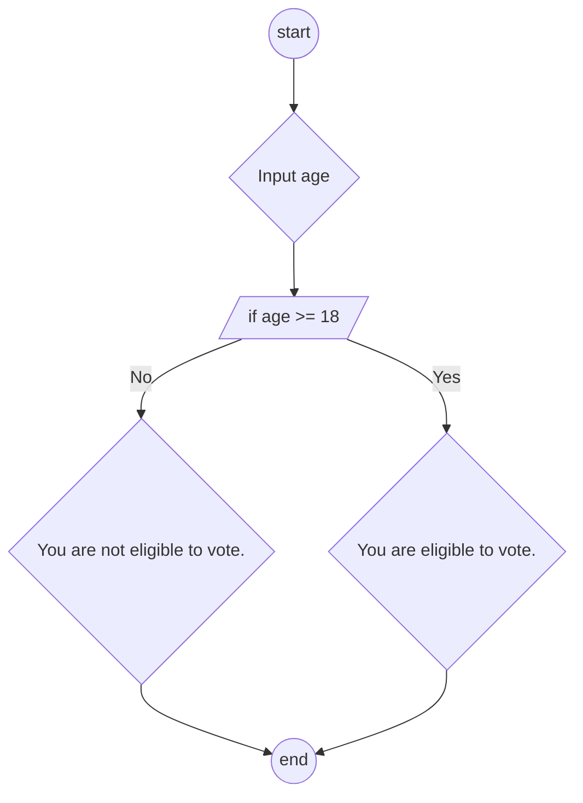

Write a program that asks the user to enter their age.

- If the age is **18 or older**, display: "You are eligible to vote."
- If the age is **less than 18**, display: "You are not eligible to vote."
- End the program.

**Pseudocode**

```
start
input age
if age >= 18
output You are eligible to vote.
else
You are not eligible to vote.
endif
end
```

**Flowchart**


