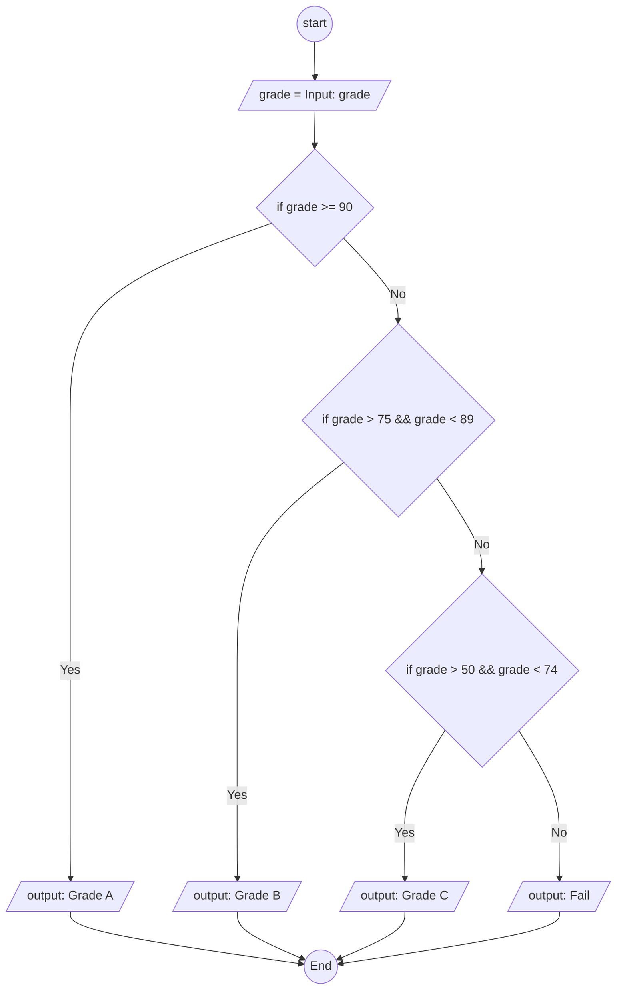

### Write a program that takes a student's marks (out of 100) as input and determines their grade

- **90 or above:** "Grade A"
- **75 to 89:** "Grade B"
- **50 to 74:** "Grade C"
- **Below 50:** "Fail"
- End the program.

**Pseudocode:**

```
Start
input marks
if grade >= 90
  output Grade A
elseIf grade > 75 and marks < 89
  output Grade B
elseIf grade > 50 and marks < 74
  output Grade C
else grade < 50
  output Grade FAil
EndIf
End

```

**Flowchart**


