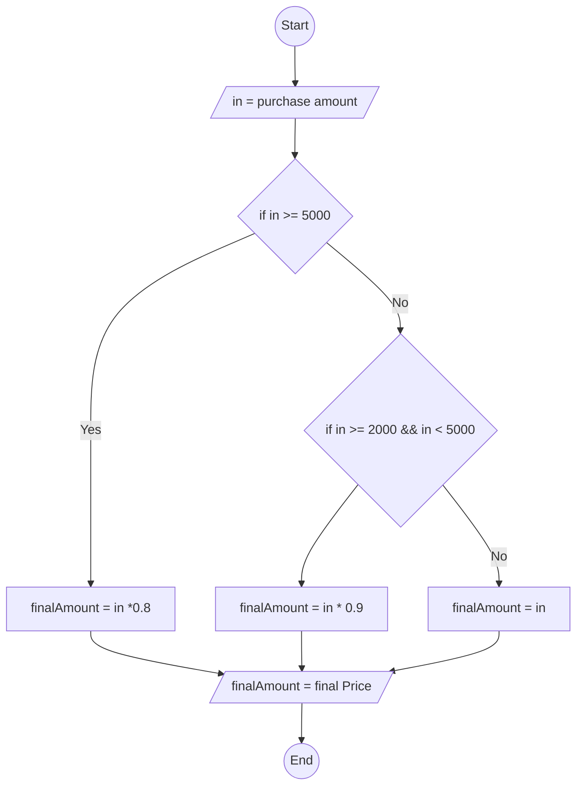

#### Exercise 4: Online Shopping Discount

Write a program that calculates the final price of an online order:

1. Input the **total purchase amount**.
2. If the amount is **5000 kr or more**, apply a **20% discount**.
3. If the amount is between **2000 kr and 4999 kr**, apply a **10% discount**.
4. If the amount is less than **2000 kr**, no discount is applied.
5. Calculate and display the **final price** after the discount.
6. End the program.

**Pseudocode:**

```
Start
input totalAmount
if totalAmount >= 5000kr
 totalAmount *= 0.8
elseIf totalAmount >= 2000 && <= 4999
 totalAmount *= 0.9
EndIf
output totalAmount
End

```

**Flowchart**


