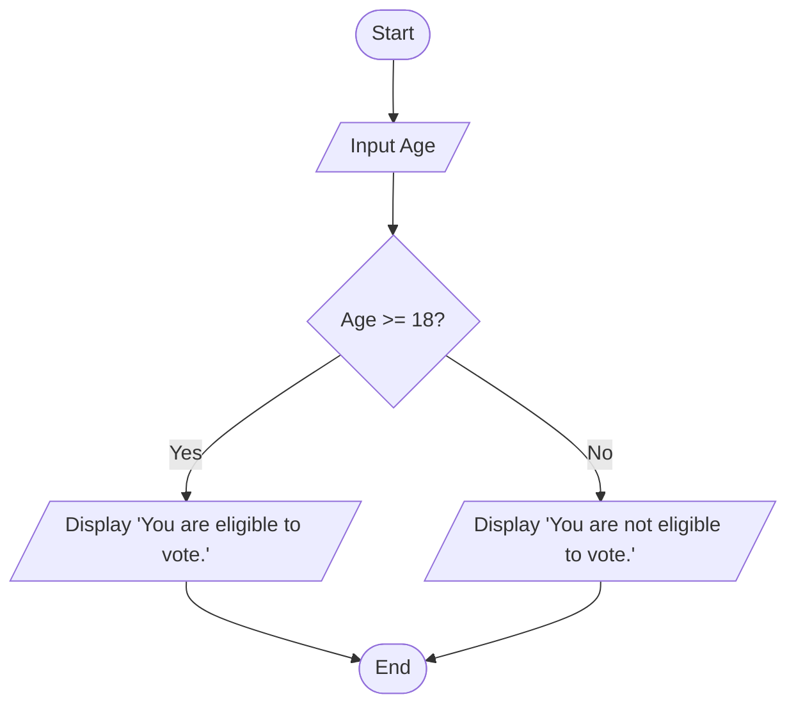
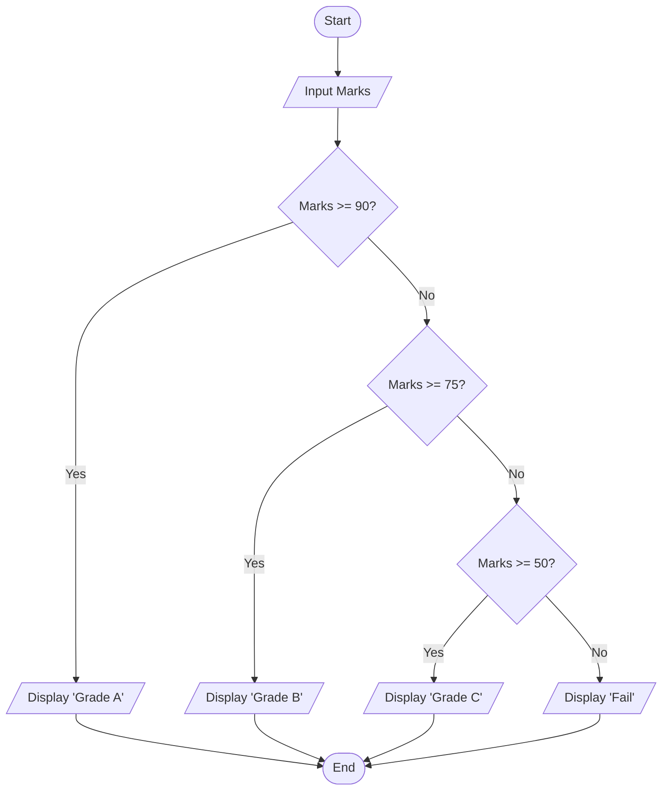
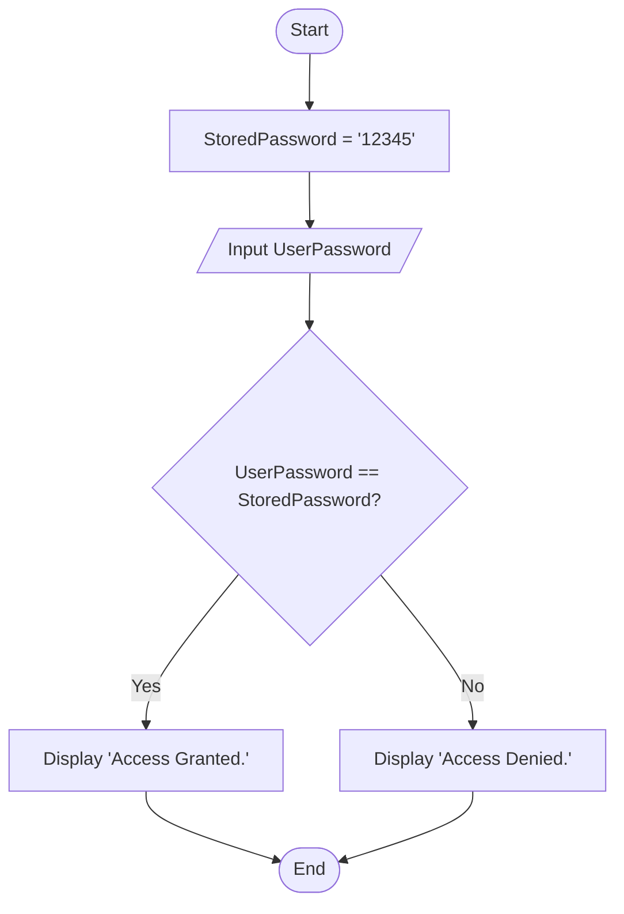
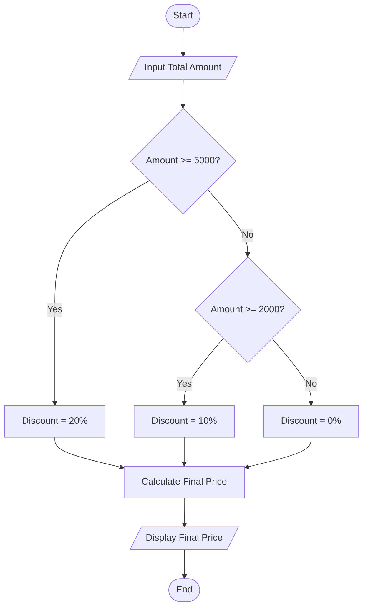
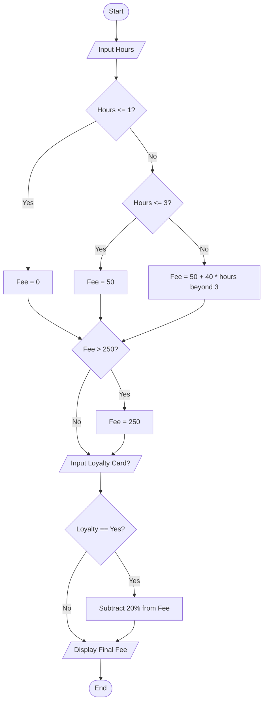

# Flowchart and Pseudocode Exercises

---

#### Exercise 1: Voting Eligibility

Write a program that asks the user to enter their age.

- If the age is **18 or older**, display: "You are eligible to vote."
- If the age is **less than 18**, display: "You are not eligible to vote."
- End the program.

**Pseudocode:**

```text
Start
  Input Age
  If Age >= 18 Then
    Display "You are eligible to vote."
  Else
    Display "You are not eligible to vote."
  EndIf
End
```

**Flowchart:**



---

#### Exercise 2: Student Grade Calculator

Write a program that takes a student's marks (out of 100) as input and determines their grade:

- **90 or above:** "Grade A"
- **75 to 89:** "Grade B"
- **50 to 74:** "Grade C"
- **Below 50:** "Fail"
- End the program.

**Pseudocode:**

```text
Start
  Input Marks
  If Marks >= 90 Then
    Display "Grade A"
  Else If Marks >= 75 Then
    Display "Grade B"
  Else If Marks >= 50 Then
    Display "Grade C"
  Else
    Display "Fail"
  EndIf
End
```

**Flowchart:**



---

#### Exercise 3: Simple Password Check

Write a program that:

1. Asks the user to enter a password.
2. Compares it with a stored password (e.g., "12345").
3. If they match, display: "Access Granted."
4. If they don't match, display: "Access Denied."
5. End the program.

**Pseudocode:**

```text
Start
  StoredPassword = "12345"
  Input UserPassword
  If UserPassword == StoredPassword Then
    Display "Access Granted."
  Else
    Display "Access Denied."
  EndIf
End
```

**Flowchart:**



---

#### Exercise 4: Online Shopping Discount

Write a program that calculates the final price of an online order:

1. Input the **total purchase amount**.
2. If the amount is **5000 kr or more**, apply a **20% discount**.
3. If the amount is between **2000 kr and 4999 kr**, apply a **10% discount**.
4. If the amount is less than **2000 kr**, no discount is applied.
5. Calculate and display the **final price** after the discount.
6. End the program.

**Pseudocode:**

```text
Start
  Input TotalAmount
  If TotalAmount >= 5000 Then
    Discount = 0.20
  Else If TotalAmount >= 2000 Then
    Discount = 0.10
  Else
    Discount = 0
  EndIf
  FinalPrice = TotalAmount - (TotalAmount * Discount)
  Display FinalPrice
End
```

**Flowchart:**



---

#### Exercise 5: Smart Parking Fee Calculator

Write a program that calculates the parking fee for a city garage:

1. Ask the user for the **number of hours** parked (e.g., 4).
2. If the time is **1 hour or less**, the fee is **0 kr** (Free).
3. If the time is **between 1 and 3 hours**, the fee is a flat **50 kr**.
4. If the time is **more than 3 hours**, calculate the fee as: **50 kr + (40 kr for every hour beyond the 3rd hour)**.
5. If the calculated fee is **greater than 250 kr**, set the fee to **250 kr** (Maximum Daily Rate).
6. Ask if the user has a **"Loyalty Card"**. If **Yes**, subtract **20%** from the fee.
7. Display the **Final Fee** and end the program.

**Pseudocode:**

```text
Start
  Input Hours
  If Hours <= 1 Then
    Fee = 0
  Else If Hours <= 3 Then
    Fee = 50
  Else
    Fee = 50 + (40 * (Hours - 3))
  EndIf

  If Fee > 250 Then
    Fee = 250
  EndIf

  Input LoyaltyCard (Yes/No)
  If LoyaltyCard == "Yes" Then
    Fee = Fee * 0.8
  EndIf

  Display Fee
End
```

**Flowchart:**


